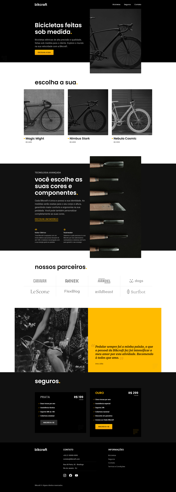

# Bikcraft 

> Site de uma loja de bicicletas elétricas feitas de acordo com o gosto do cliente.

### Ajustes e melhorias

Projeto concluído!

- [x] Desenvolvimento de todas as páginas
- [x] Páginas responsivas
- [x] Implementações básicas de JavaScript

## 💻 Pré-requisitos

Antes de começar, verifique se você atendeu aos seguintes requisitos:

* Você instalou a versão mais recente de `Node.js`.

## 🚀 Instalando Guess My Number

Para instalar o Guess My Number, siga estas etapas:

* Clone esse repositório com `git clone https://github.com/gguilhermelopes/bikcraft`
* Utilze uma extensão como a Live Server do VSCode em sua IDE para melhor visualização do site localmente

## ☕ Usando Guess My Number

Para usar Guess My Number, siga estas etapas:

* Abra o seu Live Server!
